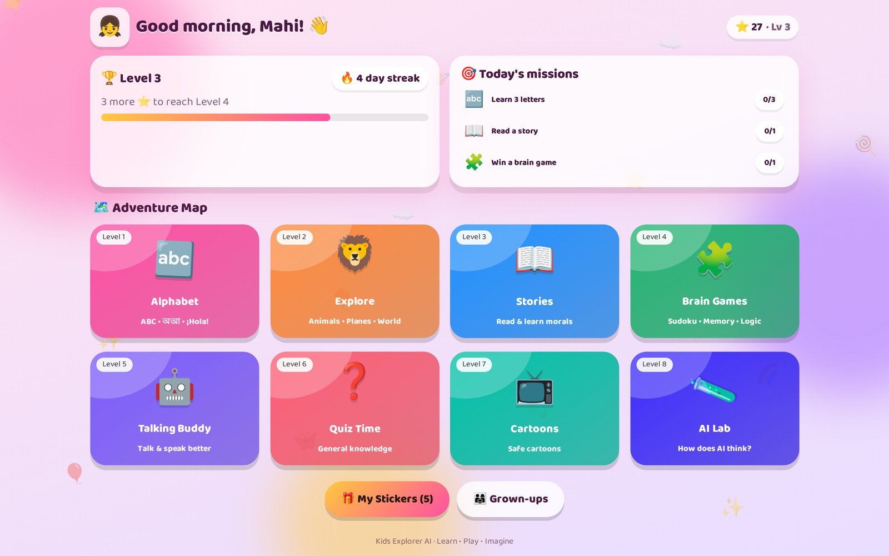
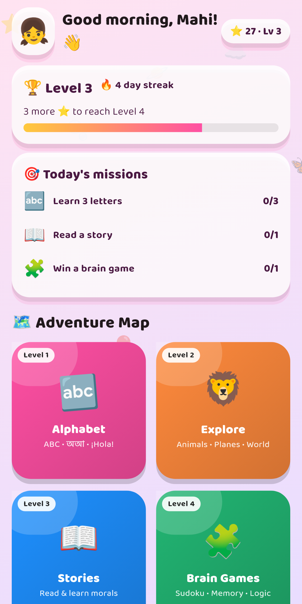
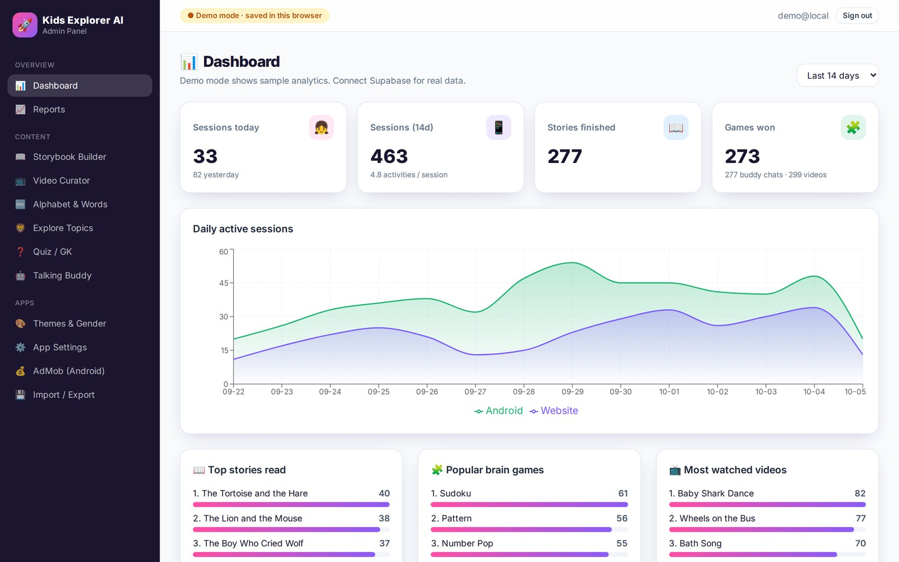
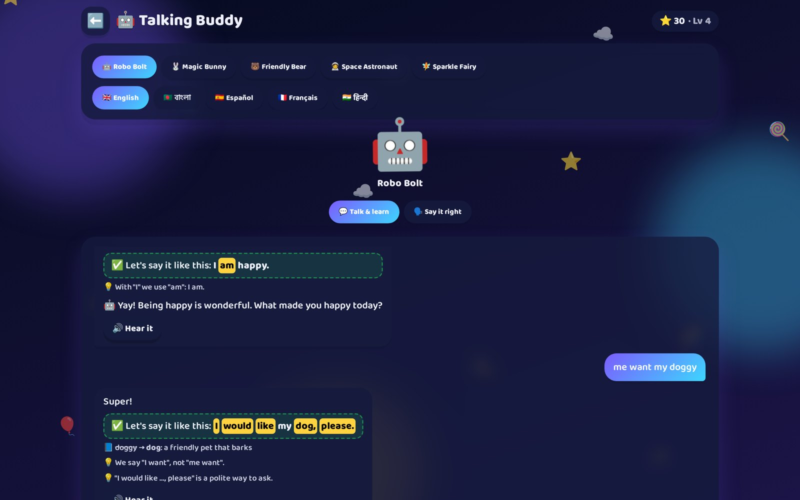
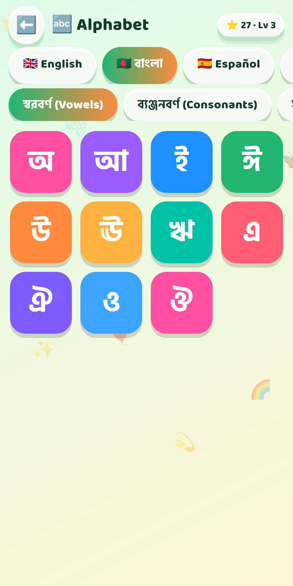
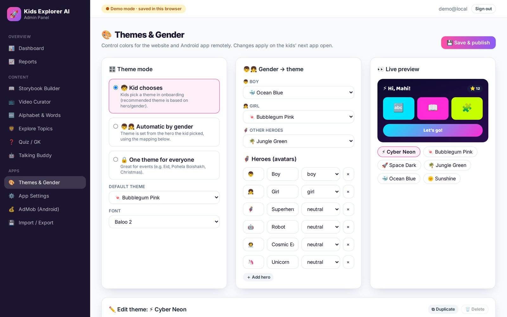
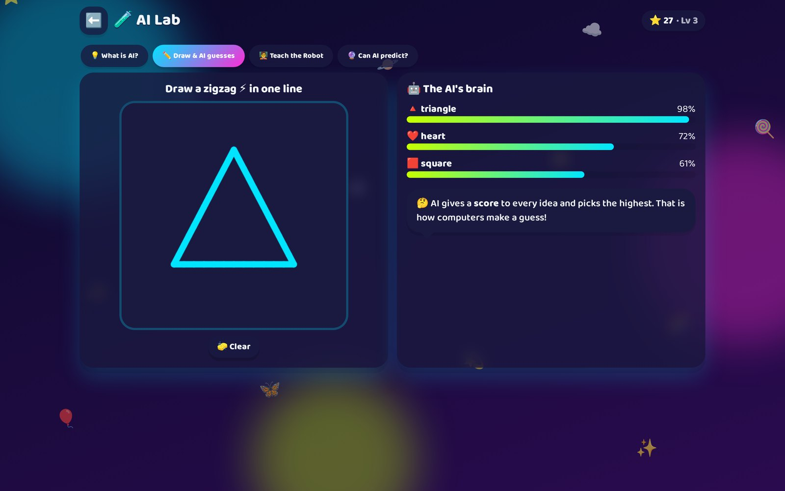
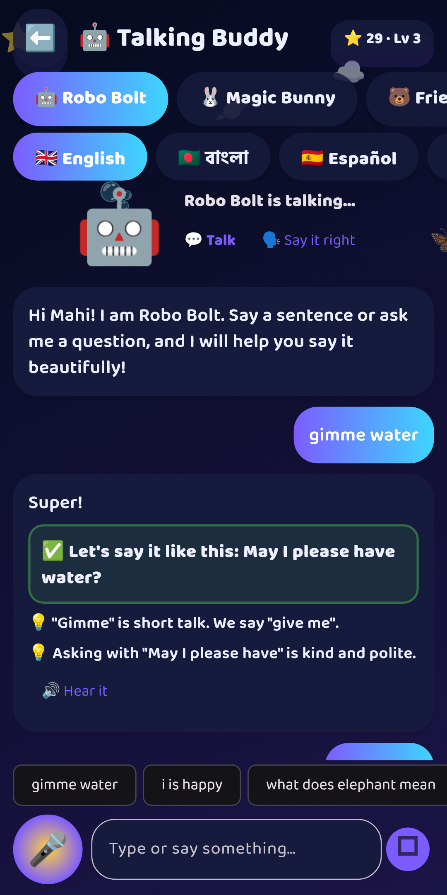
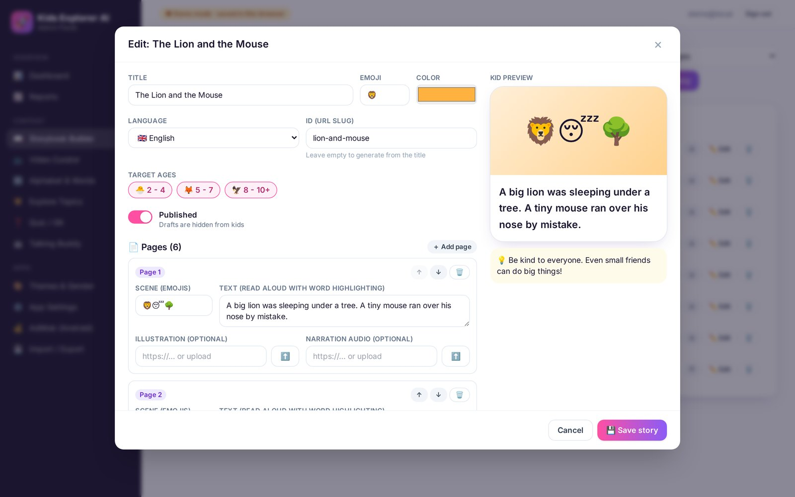
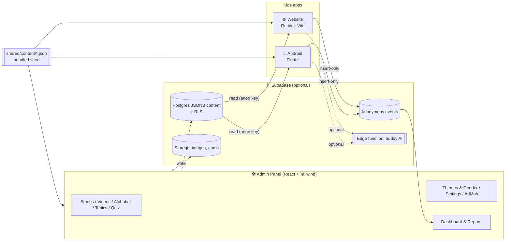

# 🚀 Kids Explorer AI (BabyBook)

> **This branch contains the 🛠️ Admin panel (React + Tailwind) — folder [`admin/`](admin/)** plus the shared content, Supabase backend and docs. The other components live on their own branches (see *Branches* below); everything together is on `claude/gallant-gates-3jkz4c`.

A free, colorful, **no sign-up** learning world for kids aged 2–10+. It ships as three apps that share one content model:

| Component | Tech | Folder | Branch |
|---|---|---|---|
| 🌐 **Kids website** | React 18 + Vite + Framer Motion + Web Speech API | [`web/`](web/) | `feature/web-app` |
| 📱 **Android app** (Google Play + AdMob ready) | Flutter 3 / Dart | [`mobile/`](mobile/) | `feature/mobile-app` |
| 🛠️ **Admin panel / dashboard** | React + Tailwind CSS + Supabase | [`admin/`](admin/) | `feature/admin-panel` |
| 🗄️ Backend (optional) | Supabase (Postgres, RLS, Storage, Edge Function) | [`supabase/`](supabase/) | all branches |

All three run **offline out of the box** with bundled sample content. Connect Supabase (free tier) when you want the admin panel to update the apps live.

---

## ✨ Features at a glance

| | Feature | Web | Android |
|---|---|:-:|:-:|
| 🎮 | **Level-style onboarding**: name → age → hero (boy / girl / superhero / robot / cosmic) → color theme | ✅ | ✅ |
| 🗺️ | **Adventure map** home with levels, stars, stickers, badges, daily missions and streaks | ✅ | ✅ |
| 🔤 | **Alphabets**: English, Bangla (vowels, consonants, numbers), Spanish, French, Hindi + any admin-added language. Animated letters, word cards, **letter tracing with sparkles**, pronunciation scoring | ✅ | ✅ |
| 📖 | **Storyteller**: page-by-page flipbook, narration with **word highlighting**, *moral of the story* card and quiz | ✅ | ✅ |
| 📺 | **Age-curated cartoons** from YouTube (privacy-enhanced, no outbound links) — admin sets videos per age group | ✅ | ✅ |
| 🧩 | **Brain games**: Kids Sudoku (3×3 icons / 4×4 / 6×6), Memory Match, What-comes-next patterns, Number Pop math, Odd One Out | ✅ | ✅ |
| 🌍 | **Explore**: animals, birds, fruits, vehicles, ships, planes, shapes, colors, numbers, countries, space, body, jobs, feelings, good habits — with audio facts, sounds, Bangla names and themed animations (drive / sail / fly / orbit…) | ✅ | ✅ |
| ❓ | **General-knowledge quiz** filtered by age | ✅ | ✅ |
| 🤖 | **Talking Buddy**: kid speaks or types in English / Bangla / Spanish / French / Hindi; buddy corrects grammar, dialect, punctuation and capitals, teaches polite/formal words and meanings, answers questions — **in voice and text**. 5 switchable voices. **100% free, on-device.** Optional cloud AI. | ✅ | ✅ |
| 🧪 | **AI Lab**: "What is AI?", Draw & the AI guesses, Teach-the-Robot (k-NN), Can-AI-predict? | ✅ | ✅ |
| 🎨 | **Themes change with the kid's gender/hero or kid choice — or the admin forces one** (6 themes, editable) | ✅ | ✅ |
| 👨‍👩‍👧 | Grown-ups zone behind a parental gate: profile, screen-time limit, wiggle breaks, learning report, erase data | ✅ | ✅ |
| 💰 | **AdMob** (banner / interstitial / rewarded) with child-directed, non-personalized, G-rated settings, remote switches | – | ✅ |
| 📊 | **Admin dashboard**: sessions, top stories, popular games, age/theme/platform split, CSV reports | 🛠️ | 🛠️ |

See [docs/FEATURES.md](docs/FEATURES.md) for the complete list and the learning research behind it.


## 📸 Screenshots

| Website | Android | Admin |
|---|---|---|
|  |  |  |
|  |  |  |
|  |  |  |

---

## 🧭 Architecture



* **Content model** – JSON documents in [`shared/content/`](shared/content/) (settings, themes, languages, stories, videos, topics, quiz, buddy rules). `node scripts/sync-content.mjs` bundles them into each app.
* **Without a backend** the admin panel works in *demo mode* and exports `content.json`, which the website (`VITE_CONTENT_URL`) and app (`CONTENT_URL`) can load from any static host.
* **With Supabase** the admin edits tables directly; apps fetch on launch and cache offline.

Details: [docs/ARCHITECTURE.md](docs/ARCHITECTURE.md).

---

## ⚡ Quick start

Prerequisites: **Node.js 20+** (web/admin) and **Flutter 3.47+ (latest stable)** with Android Studio (mobile). Full step-by-step for **Windows and macOS**: [docs/BUILD_GUIDE.md](docs/BUILD_GUIDE.md).

```bash
# 1) Website  → http://localhost:5173
cd web && npm install && npm run dev

# 2) Admin panel  → http://localhost:5174  (demo mode: any email/password)
cd admin && npm install && npm run dev

# 3) Android app  (emulator or USB device)
cd mobile && flutter pub get && flutter run
```

Tests: `cd web && npm test` · `cd mobile && flutter test` · lint: `npm run lint` / `flutter analyze`.

---

## 🌿 Branches

| Branch | Contains |
|---|---|
| `feature/web-app` | `web/` + shared content, backend, docs |
| `feature/mobile-app` | `mobile/` + shared content, backend, docs |
| `feature/admin-panel` | `admin/` + shared content, backend, docs |
| `claude/gallant-gates-3jkz4c` | Everything together (integration branch, ready to merge into `main`) |

---

## 📚 Documentation

| Doc | What's inside |
|---|---|
| [docs/BUILD_GUIDE.md](docs/BUILD_GUIDE.md) | Install & build on **Windows** and **macOS** (web, admin, Android APK/AAB) |
| [docs/ARCHITECTURE.md](docs/ARCHITECTURE.md) | Data model, content flow, theming, buddy engine, security |
| [docs/ADMIN_GUIDE.md](docs/ADMIN_GUIDE.md) | Using the admin panel day-to-day |
| [docs/PLAY_STORE_RELEASE.md](docs/PLAY_STORE_RELEASE.md) | Google Play Families policy, AdMob, Data safety, signing, release checklist |
| [docs/PRIVACY_POLICY.md](docs/PRIVACY_POLICY.md) | Privacy policy template for the store listing |
| [docs/FEATURES.md](docs/FEATURES.md) | Full feature list + learning-science rationale |
| [docs/Kids-Explorer-AI.pptx](docs/Kids-Explorer-AI.pptx) | Presentation deck of the platform |
| [web/README.md](web/README.md) · [admin/README.md](admin/README.md) · [mobile/README.md](mobile/README.md) · [supabase/README.md](supabase/README.md) | Per-component guides |

---

## 🔒 Privacy by design

No accounts, no emails, no ad identifiers. The child's name and progress never leave the device. Analytics (if a backend is configured) are anonymous counts like "a story was read". The Talking Buddy runs entirely on-device by default.

## License

Choose a license before publishing (e.g. MIT for code). Sample stories are classic public-domain fables retold; sample videos are links to public YouTube uploads — review rights for your market before release.
